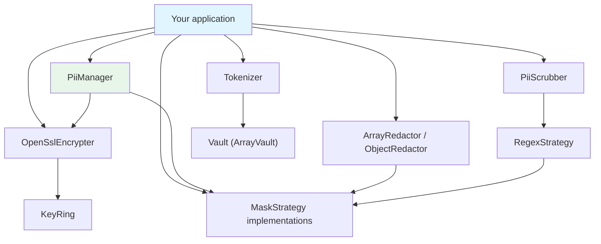

# Overview

`pii-protection` is a small library of portable primitives every application
handling personal data (SOC 2 / PDPA / GDPR) needs. There is no service
container, no boot conventions, and no static facades — just plain classes with
explicit inputs and outputs.

## The primitives

| Concern | What it does | Key classes |
|---------|--------------|-------------|
| **Masking** | Render a value partially or fully hidden for display or logs | `TailStrategy`, `FullStrategy`, `EmailStrategy`, `HashStrategy`, `CreditCardStrategy`, `IpStrategy`, `NameStrategy`, `NricStrategy`, `RegexStrategy` |
| **Encryption** | Reversible encrypt/decrypt of PII for storage at rest | `OpenSslEncrypter`, `KeyRing` |
| **Searchable lookups** | Deterministic, one-way index for equality queries | `HmacBlindIndex` |
| **Redaction** | Mask listed fields inside a payload or object | `ArrayRedactor`, `ObjectRedactor`, `#[Pii]` |
| **Detection** | Find/scrub PII patterns inside free text | `PiiScrubber`, `RegexStrategy` |
| **Tokenization** | Swap a value for an opaque token, reversible via a vault | `Tokenizer`, `Vault`, `ArrayVault` |
| **Convenience** | A wrapper that bundles an encrypter + a strategy | `PiiManager` |

## Package layout

```text
src/
├── Contracts/
│   ├── Encrypter.php           # encrypt(string): string ; decrypt(string): string
│   ├── ContextualEncrypter.php # adds AAD-bound encrypt/decrypt
│   ├── MaskStrategy.php        # mask(string): string
│   ├── Redactor.php            # redact(array $data, array $fields): array
│   └── Vault.php               # token <-> value store contract
├── Masking/
│   ├── TailStrategy.php        # keep last N chars (default 4)
│   ├── FullStrategy.php        # mask everything
│   ├── EmailStrategy.php       # mask local-part, keep domain
│   ├── HashStrategy.php        # one-way (sha256) for non-reversible PII
│   ├── CreditCardStrategy.php  # keep last 4 digits, preserve grouping
│   ├── IpStrategy.php          # mask the last octet/group
│   ├── NameStrategy.php        # keep each word's initial
│   ├── NricStrategy.php        # mask Malaysian MyKad digits, keep dashes
│   └── RegexStrategy.php       # mask substrings matching a pattern
├── Encryption/
│   ├── OpenSslEncrypter.php    # AES-256-GCM, HKDF, AAD, versioned format
│   ├── KeyRing.php             # multi-key holder for key rotation
│   └── HmacBlindIndex.php      # deterministic index for searchable lookups
├── Detection/
│   └── PiiScrubber.php         # detect/scrub PII patterns in free text
├── Tokenization/
│   ├── Tokenizer.php           # value <-> opaque token
│   └── ArrayVault.php          # in-memory Vault implementation
├── Attributes/
│   └── Pii.php                 # #[Pii] property marker
├── Exceptions/
│   ├── PiiException.php         # base (extends RuntimeException)
│   ├── EncryptionException.php
│   └── DecryptionException.php
├── ArrayRedactor.php           # nested + JSON + per-field + dot-path redaction
├── ObjectRedactor.php          # redacts #[Pii]-tagged object properties
└── PiiManager.php              # convenience wrapper over strategy + encrypter
```

## How the pieces fit together



Consumers depend on the **contracts** (`Encrypter`, `MaskStrategy`, `Redactor`,
`Vault`), not the concretions — so any piece can be swapped without touching the
call sites. See [Contracts](02-contracts.md).

## Requirements

- PHP `^8.4`
- `ext-openssl`
- `ext-mbstring`

## Next Steps

- [Contracts](02-contracts.md)
- [Design Decisions](03-design-decisions.md)
- [Getting Started](../02-usage/01-getting-started.md)
