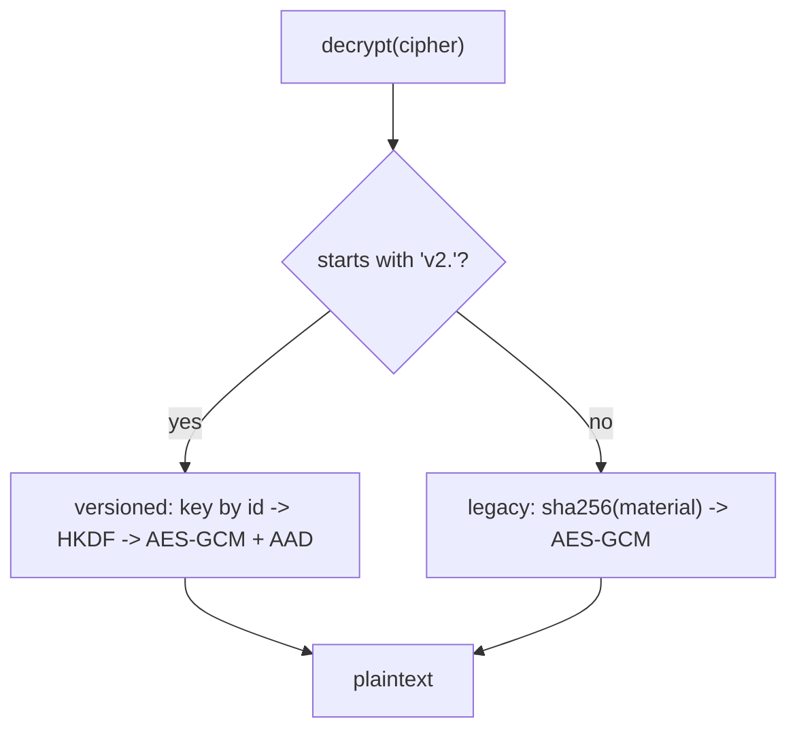

# Design Decisions

The rationale behind the choices that are not obvious from the code alone.

## Single responsibility per class

Strategies, the encrypter, the redactors, and the manager are independent and
swappable. Consumers depend on the [contracts](02-contracts.md), not the
concretions, so a class can be replaced without touching call sites.

## AES-256-GCM with per-message HKDF

`OpenSslEncrypter` uses authenticated encryption (AES-256-GCM), so tampering is
detected on decrypt via the GCM tag. For every message it:

1. generates a random 16-byte salt and a random 12-byte IV;
2. derives a per-message 256-bit data key with **HKDF-SHA256** from the ring key
   plus that salt;
3. binds the caller context as GCM **AAD**.

Per-message salts mean the same plaintext encrypts to different ciphertext every
time, and a unique derived key per message limits the blast radius of any single
key/nonce mishap.

## Versioned, self-describing ciphertext

New ciphertext is written as:

```text
v2.<keyId>.<base64( salt(16) || iv(12) || tag(16) || ciphertext )>
```

The `keyId` records which key on the [`KeyRing`](../02-usage/03-encryption.md)
encrypted the message, which is what makes key rotation possible without
re-encrypting everything up front.

## Backward compatibility (1.x guarantee)

Ciphertext produced by 1.0/1.1 used the unversioned format
`base64(iv || tag || ciphertext)` with a key derived as `sha256(material)`.
`OpenSslEncrypter::decrypt()` detects the `v2.` prefix:

- prefix present → versioned path (key by id, HKDF, AAD);
- prefix absent → **legacy path** (sha256-derived key, no AAD).

The prefix is unambiguous because `.` is not a base64 character, so legacy
ciphertext can never accidentally look versioned. Everything stays in the **1.x**
line — no breaking change to stored data.



## Guardrail — never query an encrypted column

Encryption is non-deterministic (random IV + salt per call), so two encryptions
of the same value differ and will not match in a `WHERE`/`JOIN`/unique index.

To support equality lookups, store an `HmacBlindIndex` alongside the ciphertext
and query the index — it is deterministic and one-way (it confirms a match but
cannot reveal the value). If you never need to reverse the value, `mask` or
`hash` it instead. See
[Searchable lookups](../02-usage/03-encryption.md#searchable-lookups-blind-index).

## Key handling is the caller's job

`OpenSslEncrypter` takes a key (or a `KeyRing`) in its constructor. The library
never reads environment variables or config and never persists keys. Rotation is
supported through the ring, but loading and storing key material is your
application's responsibility.

## Multibyte-safe masking

Every masking strategy uses `mb_*` functions so multibyte values are measured
and sliced by character, not byte — important for non-ASCII names and inputs.

## Next Steps

- [Encryption & Key Rotation](../02-usage/03-encryption.md)
- [API Reference](../04-api/README.md)
